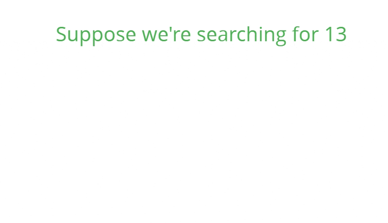
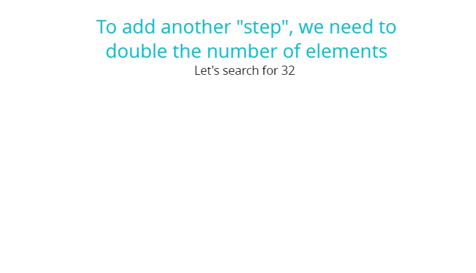
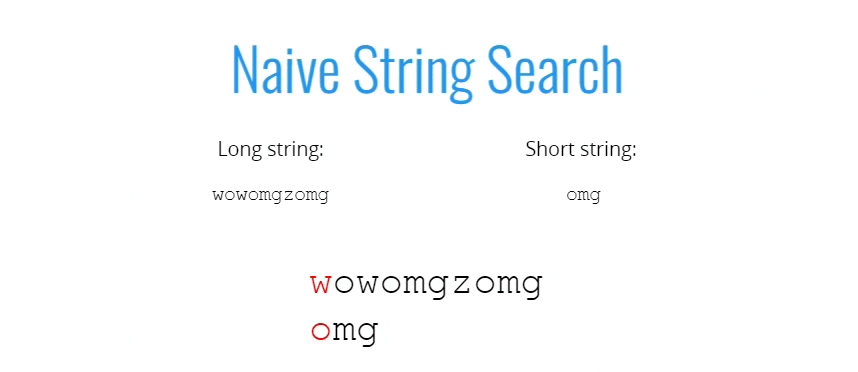

# Searching Algorithms

- Describe what a searching algorithm is
- Implement linear search on arrays
- Implement binary search on sorted arrays
- Implement a naive string searching algorithm
- Implement the KMP string searching algorithm

## Linear Search

**1. Some buil-in methods**
  - indexOf
  - includes
  - find
  - findIndex

**2. Linear Search Pseudocode**
  - This function accepts an array and a value
  - Loop through the array and check if the current array element is equal to the value
  - If it is, return the index at which the element is found
  - If the value is never found, return -1

```js
function linearSearch(arr, val) {
  for (var i  = 0; i < arr.length; i++) {
    if (arr[i] === val) return i;
  }
  return -1;
}

linearSearch([34, 56, 1, 2], 1)
```
**3. Big O**
  - O(n): Worst
  - O(n): Average (no, it's not a typo)
  - O(1): Best

## Binary Search

- Binary search is a much faster form of search
- Rather than eliminating one element at a time, you can eliminate half of the remaining elements at a time
- Binary search only works on sorted arrays!

#### Divide and Conquer


#### Example
**1. Binary Search Pseudocode**

- This function accepts a sorted array and a value
- Create a left pointer at the start of the array, and a right pointer at the end of the array
    - While the left pointer comes before the right pointer:
    - Create a pointer in the middle
    - If you find the value you want, return the index
    - If the value is too small, move the left pointer up
    - If the value is too large, move the right pointer down
- If you never find the value, return -1

**2. Code**
```js
// Original Solution
function binarySearch(arr, elem) {
    var start = 0;
    var end = arr.length - 1;
    var middle = Math.floor((start + end) / 2);
    while (arr[middle] !== elem && start <= end) {
        if (elem < arr[middle]) {
            end = middle - 1;
        } else {
            start = middle + 1;
        }
        middle = Math.floor((start + end) / 2);
    }
    if (arr[middle] === elem) {
        return middle;
    }
    return -1;
}

// Refactored Version
function binarySearch(arr, elem) {
    var start = 0;
    var end = arr.length - 1;
    var middle = Math.floor((start + end) / 2);
    while (arr[middle] !== elem && start <= end) {
        if (elem < arr[middle]) end = middle - 1;
        else start = middle + 1;
        middle = Math.floor((start + end) / 2);
    }
    return arr[middle] === elem ? middle : -1;
}

binarySearch([2, 5, 6, 9, 13, 15, 28, 30], 103);

```

**3. Big O**

- O(log n): Worst and Average Case
- O(1): Best case





## String search

- Suppose you want to count the number of times a smaller string appears in a longer string
- A straightforward approach involves checking pairs of characters individually



### Example

**1. Pseudocode**

  - Loop over the longer string
  - Loop over the shorter string
  - If the characters don't match, break out of the inner loop
  - If the characters do match, keep going
  - If you complete the inner loop and find a match, increment the count of matches
  - Return the count

**2. Code**
 - Naive Search
```js
function naiveSearch(str1, str2) {
    let counter = 0;
    for (let i = 0; i < str1.length; i++) {
        for (let j = 0; j < str2.length; j++) {
            if (str2[j] !== str1[i + j]) {
                break;
            }
            if (j === str2.length - 1) {
                counter++;
            }
        }
    }
    return counter;
}

// Learn about KMP search algorithm
```

  - KMP Search:
    - The Knutt-Morris-Pratt algorithm offers an improvement over the naive approach
    - Published in 1977
    - This algorithm more intelligently traverses the longer string to reduce the amount of redundant searching
    - Resources:
        - *[9.1 Knuth-Morris-Pratt KMP String Matching Algorithm][KMP-01]*
        - *[KMP Algorithm | Searching for Patterns | GeeksforGeeks][KMP-02]*

[KMP-01]: https://www.youtube.com/watch?v=V5-7GzOfADQ&feature=youtu.be
[KMP-02]: https://www.youtube.com/watch?v=cH-5KcgUcOE&feature=youtu.be
