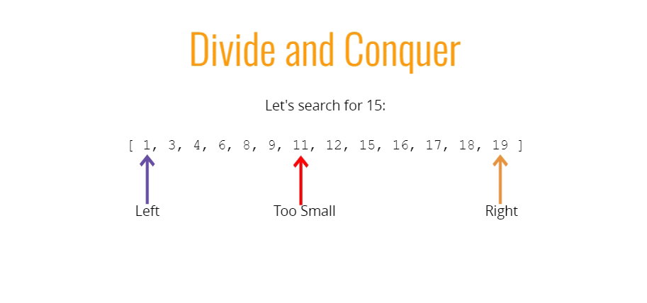

# Searching Algorithms

- Describe what a searching algorithm is
- Implement linear search on arrays
- Implement binary search on sorted arrays
- Implement a naive string searching algorithm
- Implement the KMP string searching algorithm

## Linear Search

**1. Some buil-in methods**
  - indexOf
  - includes
  - find
  - findIndex

**2. Linear Search Pseudocode**
  - This function accepts an array and a value
  - Loop through the array and check if the current array element is equal to the value
  - If it is, return the index at which the element is found
  - If the value is never found, return -1

```js
function linearSearch(arr, val) {
  for (var i  = 0; i < arr.length; i++) {
    if (arr[i] === val) return i;
  }
  return -1;
}

linearSearch([34, 56, 1, 2], 1)
```
**3. Big O**
  - O(n): Worst
  - O(n): Average (no, it's not a typo)
  - O(1): Best

## Binary Search

- Binary search is a much faster form of search
- Rather than eliminating one element at a time, you can eliminate half of the remaining elements at a time
- Binary search only works on sorted arrays!

#### Divide and Conquer


