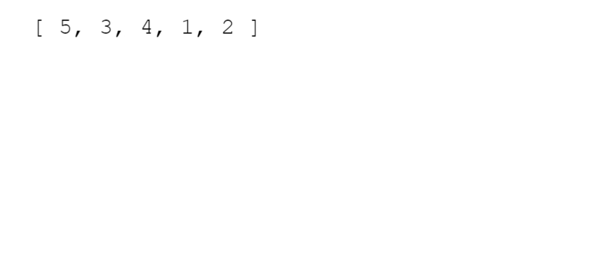

# Elementary Sorting Algorithms
Sorting is the process of rearranging the items in a collection (e.g. an array) so that the items are in some kind of order.

**<details><summary>Examples</summary>**

- Sorting numbers from smallest to largest
- Sorting names alphabetically
- Sorting movies based on release year
- Sorting movies based on revenue

</details>

**<details><summary>Why do we need to learn this?</summary>**
- Sorting is an incredibly common task, so it's good to know how it works
- There are many different ways to sort things, and different techniques have their own advantages and disadvantages
- Sorting sometimes has quirks, so it's good to understand how to navigate them
</details>

#### 1. Built-in JS .sort()

It doesn't always work the way you expect.

😃😃😃
```js
[ "Steele", "Colt", "Data Structures", "Algorithms" ].sort();
// [ "Algorithms", "Colt", "Data Structures", "Steele" ]
```
😟😟😟

```js
[ 6, 4, 15, 10 ].sort();
// [ 10, 15, 4, 6 ]
```

#### 2. Telling JavaScript how to sort

- The *[built-in .sort() method](https://developer.mozilla.org/en-US/docs/Web/JavaScript/Reference/Global_Objects/Array/sort)* accepts an optional comparator function
- You can use this comparator function to tell JavaScript how you want it to sort
- The comparator looks at pairs of elements (a and b), determines their sort order based on the return value
  - If it returns a negative number, a should come before b
  - If it returns a positive number, a should come after b,
  - If it returns 0, a and b are the same as far as the sort is concerned

```js
function numberCompare(num1, num2) {
  return num1 - num2;
}

[ 6, 4, 15, 10 ].sort(numberCompare);
// [ 4, 6, 10, 15 ]
```

```js
function compareByLen(str1, str2) {
  return str1.length - str2.length;
}

[ "Steele", "Colt", "Data Structures", "Algorithms" ]
  .sort(compareByLen);
// [ "Colt", "Steele", "Algorithms", "Data Structures" ]
```

## Bubble Sort

A sorting algorithm where the largest values bubble up to the top!



#### Bubble Sort Implementation
**1. Swap**

```js
// ES5
function swap(arr, idx1, idx2) {
  var temp = arr[idx1];
  arr[idx1] = arr[idx2];
  arr[idx2] = temp;
}

// ES2015
const swap = (arr, idx1, idx2) => {
  [arr[idx1],arr[idx2]] = [arr[idx2],arr[idx1]];
}
```
**2. Pseudocode**
- Start looping from with a variable called i the end of the array towards the beginning
- Start an inner loop with a variable called j from the beginning until i - 1
- If arr[j] is greater than arr[j+1], swap those two values!
- Return the sorted array

**3. Code**

Check the code *[here](Bubble_Sort.js)*

#### Bubble Sort Optimization

#### Bubble Sort BIG O

| Best | Average          | Worst            |
| :--- | :--------------- | :--------------- |
| O(n) | O(n<sup>2</sup>) | O(n<sup>2</sup>) |

## Selection Sort

Similar to bubble sort, but instead of first placing large values into sorted position, it places small values into sorted position

[selection-sort-01](img/selection-sort-01.gif)

#### Selection Sort Implementation

- Store the first element as the smallest value you've seen so far.
- Compare this item to the next item in the array until you find a smaller number.
- If a smaller number is found, designate that smaller number to be the new "minimum" and continue until the end of the array.
- If the "minimum" is not the value (index) you initially began with, swap the two values.
- Repeat this with the next element until the array is sorted.

- Click *[here](Selection_sort.js)* to try the code

#### Selection Sort BIG O

**O(n<sup>2</sup>)**

## Insertion Sort

Builds up the sort by gradually creating a larger left half which is always sorted

[insertion-sort](img/insertion-sort-01.gif)

#### Insertion Sort Implementation

- Start by picking the second element in the array
- Now compare the second element with the one before it and swap if necessary.
- Continue to the next element and if it is in the incorrect order, iterate through the sorted portion (i.e. the left side) to place the element in the correct place.
- Repeat until the array is sorted.


#### Insertion Sort BIG O

| Best | Average          | Worst            |
| :--- | :--------------- | :--------------- |
| O(n) | O(n<sup>2</sup>) | O(n<sup>2</sup>) |

## Comparing Bubble, Selection, and Insertion Sort

| Algorithm      | Time Complexity (Best) | Time Complexity (Average) | Time Complexity (Worst) | Space Complexity |
| :------------- | :--------------------- | :------------------------ | :---------------------- | :--------------- |
| Bubble Sort    | O(n)                   | O(n<sup>2</sup>)          | O(n<sup>2</sup>)        | O(1)             |
| Insertion Sort | O(n)                   | O(n<sup>2</sup>)          | O(n<sup>2</sup>)        | O(1)             |
| Selection Sort | O(n<sup>2</sup>)       | O(n<sup>2</sup>)          | O(n<sup>2</sup>)        | O(1)             |

# Intermediate Sorting Algotrithms

**<details><summary>Why do we need to learn this?</summary>**
- The sorting algorithms we've learned so far don't scale well
- Try out bubble sort on an array of 100000 elements, it will take quite some time!
- We need to be able to sort large arrays more quickly
</details>

**<details><summary>FASTER SORTS</summary>**
- There is a family of sorting algorithms that can improve time complexity from O(n<sup>2</sup>) to O(n log n)
- There's a tradeoff between efficiency and simplicity
- The more efficient algorithms are much less simple, and generally take longer to understand
</details>

## Merge Sort

**Merge Sort: Introduction**

- It's a combination of two things - merging and sorting!
- Exploits the fact that arrays of 0 or 1 element are always sorted
- Works by decomposing an array into smaller arrays of 0 or 1 elements, then building up a newly sorted array

**Merging Arrays: Intro**

[merge-sort](img/merge-sort-01.gif)

#### Merge Sort Implementation
#### Merge Sort BIG O

## Quick Sort
#### Pivot Helper

**1. Introduction**
**2. Implementation**

#### Quick Sort Implementation
#### Quick Sort Call Stack
#### Quick Sort BIG O

## Radix Sort
#### Radix Sort Helper Methods
#### Radix Sort Pseudocode
#### Radix Sort Implementation
#### Radix Sort BIG O
