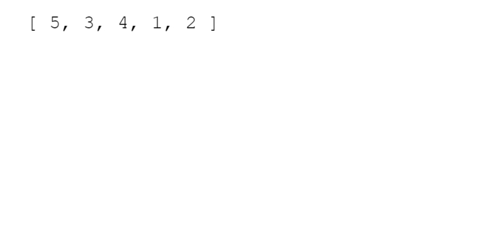

# Sorting
Sorting is the process of rearranging the items in a collection (e.g. an array) so that the items are in some kind of order.

**<details><summary>Examples</summary>**

- Sorting numbers from smallest to largest
- Sorting names alphabetically
- Sorting movies based on release year
- Sorting movies based on revenue

</details>

#### Why do we need to learn this?

- Sorting is an incredibly common task, so it's good to know how it works
- There are many different ways to sort things, and different techniques have their own advantages and disadvantages
- Sorting sometimes has quirks, so it's good to understand how to navigate them

#### Built-in JS .sort()

It doesn't always work the way you expect.

😃😃😃
```js
[ "Steele", "Colt", "Data Structures", "Algorithms" ].sort();
// [ "Algorithms", "Colt", "Data Structures", "Steele" ]
```
😟😟😟

```js
[ 6, 4, 15, 10 ].sort();
// [ 10, 15, 4, 6 ]
```

#### Telling JavaScript how to sort

- The built-in sort method accepts an optional comparator function
- You can use this comparator function to tell JavaScript how you want it to sort
- The comparator looks at pairs of elements (a and b), determines their sort order based on the return value
  - If it returns a negative number, a should come before b
  - If it returns a positive number, a should come after b,
  - If it returns 0, a and b are the same as far as the sort is concerned

```js
function numberCompare(num1, num2) {
  return num1 - num2;
}

[ 6, 4, 15, 10 ].sort(numberCompare);
// [ 4, 6, 10, 15 ]
```

```js
function compareByLen(str1, str2) {
  return str1.length - str2.length;
}

[ "Steele", "Colt", "Data Structures", "Algorithms" ]
  .sort(compareByLen);
// [ "Colt", "Steele", "Algorithms", "Data Structures" ]
```

## Bubble Sort

A sorting algorithm where the largest values bubble up to the top!



#### Bubble Sort Implementation
**1. Swap**

```js
// ES5
function swap(arr, idx1, idx2) {
  var temp = arr[idx1];
  arr[idx1] = arr[idx2];
  arr[idx2] = temp;
}

// ES2015
const swap = (arr, idx1, idx2) => {
  [arr[idx1],arr[idx2]] = [arr[idx2],arr[idx1]];
}
```
**2. Pseudocode**
- Start looping from with a variable called i the end of the array towards the beginning
- Start an inner loop with a variable called j from the beginning until i - 1
- If arr[j] is greater than arr[j+1], swap those two values!
- Return the sorted array
#### Bubble Sort Optimization
#### Bubble Sort BIG O

## Selection Sort
#### Selection Sort Implementation
#### Selection Sort BIG O

## Insertion Sort
#### Insertion Sort Implementation
#### Insertion Sort BIG O

## Comparing Bubble, Selection, and Insertion Sort

## Merge Sort

**1. Intro to the "Crazier" Sorts**
**2. Merge Sort: Introduction**
**3. Merging Arrays: Intro**

#### Merge Sort Implementation
#### Merge Sort BIG O

## Quick Sort
#### Pivot Helper

**1. Introduction**
**2. Implementation**

#### Quick Sort Implementation
#### Quick Sort Call Stack
#### Quick Sort BIG O

## Radix Sort
#### Radix Sort Helper Methods
#### Radix Sort Pseudocode
#### Radix Sort Implementation
#### Radix Sort BIG O
