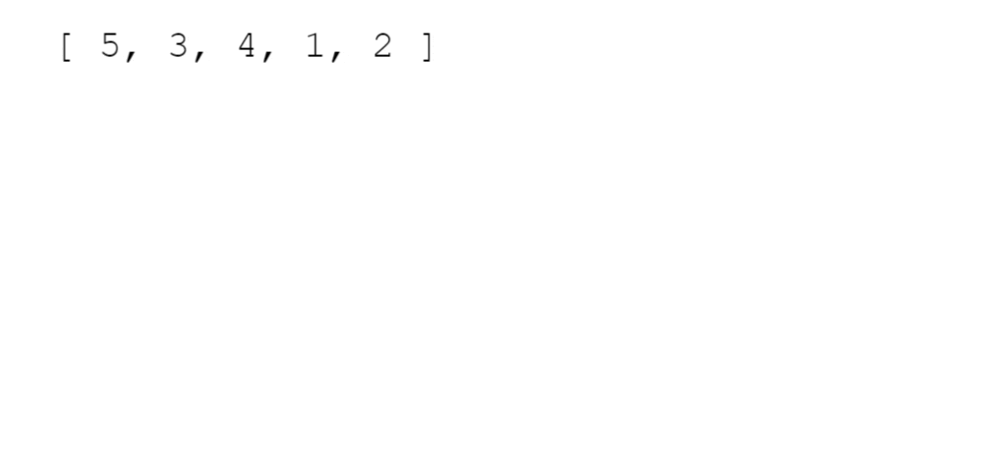
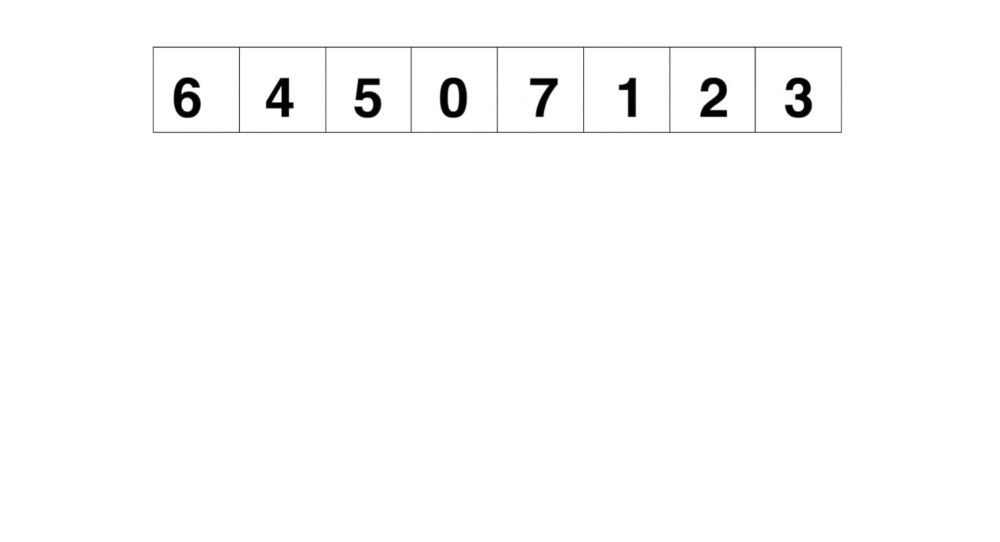

# Elementary Sorting Algorithms
**You can check for the summary notes *[here](SUMMARY.md)***

### Table of Content

1. [Sorting Overview](#sorting)
2. [Bubble Sort](#bubble-sort)
3. [Selection Sort](#selection-sort)
4. [Insertion Sort](#insertion-sort)
5. [Merge Sort](#merge-sort)
6. [Quick Sort](#quick-sort)
7. [Radix Sort](#radix-sort)

### Sorting

Sorting is the process of rearranging the items in a collection (e.g. an array) so that the items are in some kind of order.

**<details><summary>Examples</summary>**

- Sorting numbers from smallest to largest
- Sorting names alphabetically
- Sorting movies based on release year
- Sorting movies based on revenue

</details>

**<details><summary>Why do we need to learn this?</summary>**
- Sorting is an incredibly common task, so it's good to know how it works
- There are many different ways to sort things, and different techniques have their own advantages and disadvantages
- Sorting sometimes has quirks, so it's good to understand how to navigate them
</details>

[↑ Table of Content ](#table-of-content)

#### 1. Built-in JS .sort()

It doesn't always work the way you expect.

😃😃😃
```js
[ "Steele", "Colt", "Data Structures", "Algorithms" ].sort();
// [ "Algorithms", "Colt", "Data Structures", "Steele" ]
```
😟😟😟

```js
[ 6, 4, 15, 10 ].sort();
// [ 10, 15, 4, 6 ]
```

#### 2. Telling JavaScript how to sort

- The *[built-in .sort() method](https://developer.mozilla.org/en-US/docs/Web/JavaScript/Reference/Global_Objects/Array/sort)* accepts an optional comparator function
- You can use this comparator function to tell JavaScript how you want it to sort
- The comparator looks at pairs of elements (a and b), determines their sort order based on the return value
  - If it returns a negative number, a should come before b
  - If it returns a positive number, a should come after b,
  - If it returns 0, a and b are the same as far as the sort is concerned

```js
function numberCompare(num1, num2) {
  return num1 - num2;
}

[ 6, 4, 15, 10 ].sort(numberCompare);
// [ 4, 6, 10, 15 ]
```

```js
function compareByLen(str1, str2) {
  return str1.length - str2.length;
}

[ "Steele", "Colt", "Data Structures", "Algorithms" ]
  .sort(compareByLen);
// [ "Colt", "Steele", "Algorithms", "Data Structures" ]
```

## Bubble Sort

A sorting algorithm where the largest values bubble up to the top!



#### Bubble Sort Implementation
**1. Swap**

```js
// ES5
function swap(arr, idx1, idx2) {
  var temp = arr[idx1];
  arr[idx1] = arr[idx2];
  arr[idx2] = temp;
}

// ES2015
const swap = (arr, idx1, idx2) => {
  [arr[idx1],arr[idx2]] = [arr[idx2],arr[idx1]];
}
```
**2. Pseudocode**
- Start looping from with a variable called i the end of the array towards the beginning
- Start an inner loop with a variable called j from the beginning until i - 1
- If arr[j] is greater than arr[j+1], swap those two values!
- Return the sorted array

**3. Code**

Check the code *[here](Bubble_Sort.js)*


#### Bubble Sort BIG O

| Best | Average          | Worst            |
| :--- | :--------------- | :--------------- |
| O(n) | O(n<sup>2</sup>) | O(n<sup>2</sup>) |

[↑ Table of Content ](#table-of-content)

## Selection Sort

Similar to bubble sort, but instead of first placing large values into sorted position, it places small values into sorted position


#### Selection Sort Implementation

- Store the first element as the smallest value you've seen so far.
- Compare this item to the next item in the array until you find a smaller number.
- If a smaller number is found, designate that smaller number to be the new "minimum" and continue until the end of the array.
- If the "minimum" is not the value (index) you initially began with, swap the two values.
- Repeat this with the next element until the array is sorted.

- Click *[here](Selection_Sort.js)* to try the code

#### Selection Sort BIG O

**O(n<sup>2</sup>)**

[↑ Table of Content ](#table-of-content)

## Insertion Sort

Builds up the sort by gradually creating a larger left half which is always sorted


#### Insertion Sort Implementation

- Start by picking the second element in the array
- Now compare the second element with the one before it and swap if necessary.
- Continue to the next element and if it is in the incorrect order, iterate through the sorted portion (i.e. the left side) to place the element in the correct place.
- Repeat until the array is sorted.


#### Insertion Sort BIG O

| Best | Average          | Worst            |
| :--- | :--------------- | :--------------- |
| O(n) | O(n<sup>2</sup>) | O(n<sup>2</sup>) |

[↑ Table of Content ](#table-of-content)

## Comparing Bubble, Selection, and Insertion Sort

| Algorithm      | Time Complexity (Best) | Time Complexity (Average) | Time Complexity (Worst) | Space Complexity |
| :------------- | :--------------------- | :------------------------ | :---------------------- | :--------------- |
| Bubble Sort    | O(n)                   | O(n<sup>2</sup>)          | O(n<sup>2</sup>)        | O(1)             |
| Insertion Sort | O(n)                   | O(n<sup>2</sup>)          | O(n<sup>2</sup>)        | O(1)             |
| Selection Sort | O(n<sup>2</sup>)       | O(n<sup>2</sup>)          | O(n<sup>2</sup>)        | O(1)             |

[↑ Table of Content ](#table-of-content)

# Intermediate Sorting Algotrithms

**<details><summary>Why do we need to learn this?</summary>**
- The sorting algorithms we've learned so far don't scale well
- Try out bubble sort on an array of 100000 elements, it will take quite some time!
- We need to be able to sort large arrays more quickly
</details>

**<details><summary>FASTER SORTS</summary>**
- There is a family of sorting algorithms that can improve time complexity from O(n<sup>2</sup>) to O(n log n)
- There's a tradeoff between efficiency and simplicity
- The more efficient algorithms are much less simple, and generally take longer to understand
</details>

## Merge Sort



**Merge Sort: Introduction**

- It's a combination of two things - merging and sorting!
- Exploits the fact that arrays of 0 or 1 element are always sorted
- Works by decomposing an array into smaller arrays of 0 or 1 elements, then building up a newly sorted array

**Merging Arrays: Intro**

- In order to implement merge sort, it's useful to first implement a function responsible for merging two sorted arrays
- Given two arrays which are sorted, this helper function should create a new array which is also sorted, and consists of all of the elements in the two input arrays
- This function should run in O(n + m) time and O(n + m) space and should not modify the parameters passed to it.

#### Merge Sort Implementation

- Create an empty array, take a look at the smallest values in each input array
- While there are still values we haven't looked at...
  - If the value in the first array is smaller than the value in the second array, push the value in the first array into our results and move on to the next value in the first array
  - If the value in the first array is larger than the value in the second array, push the value in the second array into our results and move on to the next value in the second array
  - Once we exhaust one array, push in all remaining values from the other array

**1. mergeSort Pseudocode**

- Break up the array into halves until you have arrays that are empty or have one element
- Once you have smaller sorted arrays, merge those arrays with other sorted arrays until you are back at the full length of the array
- Once the array has been merged back together, return the merged (and sorted!) array

**2. [mergeSort code](Merge_Sort.js)**

#### Merge Sort BIG O

| Time Complexity (Best) | Time Complexity (Average) | Time Complexity (Worst) | Space Complexity |
| :--------------------- | :------------------------ | :---------------------- | :--------------- |
| O(n log n)             | O(n log n)                | O(n log n)              | O(n)             |

[↑ Table of Content ](#table-of-content)

## Quick Sort


**<details><summary>Why do we need to learn this?</summary>**

- Like merge sort, exploits the fact that arrays of 0 or 1 element are always sorted
- Works by selecting one element (called the "pivot") and finding the index where the pivot should end up in the sorted array
- Once the pivot is positioned appropriately, quick sort can be applied on either side of the pivot

</details>

#### Pivot Helper

**<details><summary>1. Introduction </summary>**

- In order to implement merge sort, it's useful to first implement a function responsible arranging elements in an array on either side of a pivot
- Given an array, this helper function should designate an element as the pivot
- It should then rearrange elements in the array so that all values less than the pivot are moved to the left of the pivot, and all values greater than the pivot are moved to the right of the pivot
- The order of elements on either side of the pivot doesn't matter!
- The helper should do this in place, that is, it should not create a new array
- When complete, the helper should return the index of the pivot
</details>

**<details><summary>2. Implementation</summary>**

- The runtime of quick sort depends in part on how one selects the pivot
- Ideally, the pivot should be chosen so that it's roughly the median value in the data set you're sorting
- For simplicity, we'll always choose the pivot to be the first element (we'll talk about consequences of this later)
-
```js
let arr = [ 5, 2, 1, 8, 4, 7, 6, 3 ]

pivot(arr); // 4;

arr;
// any one of these is an acceptable mutation:
// [2, 1, 4, 3, 5, 8, 7, 6]
// [1, 4, 3, 2, 5, 7, 6, 8]
// [3, 2, 1, 4, 5, 7, 6, 8]
// [4, 1, 2, 3, 5, 6, 8, 7]
// there are other acceptable mutations too!
```
</details>


**<details><summary>3. Pseudocode </summary>**

- It will help to accept three arguments: an array, a start index, and an end index (these can default to 0 and the array length minus 1, respectively)
- Grab the pivot from the start of the array
- Store the current pivot index in a variable (this will keep track of where the pivot should end up)
- Loop through the array from the start until the end
    - If the pivot is greater than the current element, increment the pivot index variable and then swap the current element with the element at the pivot index
- Swap the starting element (i.e. the pivot) with the pivot index
- Return the pivot index
</details>

#### Quick Sort Implementation

- Call the pivot helper on the array
- When the helper returns to you the updated pivot index, recursively call the pivot helper on the subarray to the left of that index, and the subarray to the right of that index
- Your base case occurs when you consider a subarray with less than 2 elements

#### Quick Sort Call Stack
#### Quick Sort BIG O

| Time Complexity (Best) | Time Complexity (Average) | Time Complexity (Worst) | Space Complexity |
| :--------------------- | :------------------------ | :---------------------- | :--------------- |
| O(n log n)             | O(n log n)                | O(n<sup>2</sup>)        | O(log n)         |

[↑ Table of Content ](#table-of-content)

## Radix Sort

<details><summary>Radix sort is a special sorting algorithm that works on lists of numbers</summary>

- It exploits the fact that information about the size of a number is encoded in the number of digits.
- More digits means a bigger number!
- It never makes comparisons between elements!

</details>

#### Radix Sort Helper Methods

In order to implement radix sort, it's helpful to build a few helper functions first:

   - getDigit(num, place) - returns the digit in num at the given place value
```js
function getDigit(num, i) {
  return Math.floor(Math.abs(num) / Math.pow(10, i)) % 10;
}

getDigit(12345, 0); // 5
getDigit(12345, 1); // 4
getDigit(12345, 2); // 3
getDigit(12345, 3); // 2
getDigit(12345, 4); // 1
getDigit(12345, 5); // 0
```
  - digitCount(num) - returns the number of digits in num
```js

function digitCount(num) {
  if (num === 0) return 1;
  return Math.floor(Math.log10(Math.abs(num))) + 1;
}

digitCount(1); // 1
digitCount(25); // 2
digitCount(314); // 3
```
  - mostDigits(nums) - Given an array of numbers, returns the number of digits in the largest numbers in the list

```js
function mostDigits(nums) {
  let maxDigits = 0;
  for (let i = 0; i < nums.length; i++) {
    maxDigits = Math.max(maxDigits, digitCount(nums[i]));
  }
  return maxDigits;
}

mostDigits([1234, 56, 7]); // 4
mostDigits([1, 1, 11111, 1]); // 5
mostDigits([12, 34, 56, 78]); // 2

```
#### Radix Sort Pseudocode

- Define a function that accepts list of numbers
- Figure out how many digits the largest number has
- Loop from k = 0 up to this largest number of digits
- For each iteration of the loop:
    - Create buckets for each digit (0 to 9)
    - place each number in the corresponding bucket based on its kth digit
- Replace our existing array with values in our buckets, starting with 0 and going up to 9
- return list at the end

#### Radix Sort Implementation

Check out the code *[here](Radix_Sort.js)*!

#### Radix Sort BIG O

| Time Complexity (Best) | Time Complexity (Average) | Time Complexity (Worst) | Space Complexity |
| :--------------------- | :------------------------ | :---------------------- | :--------------- |
| O(nk)                  | O(nk)                     | O(nk)                   | O(n + k)         |

- n - length of array
- k - number of digits(average)

[↑ Table of Content ](#table-of-content)

## Recap

- Merge sort and quick sort are standard efficient sorting algorithms
- Quick sort can be slow in the worst case, but is comparable to merge sort on average
- Merge sort takes up more memory because it creates a new array (in-place merge sorts exist, but they are really complex!)
- Radix sort is a fast sorting algorithm for numbers
- Radix sort exploits place value to sort numbers in linear time (for a fixed number of digits)

[↑ Table of Content ](#table-of-content)
