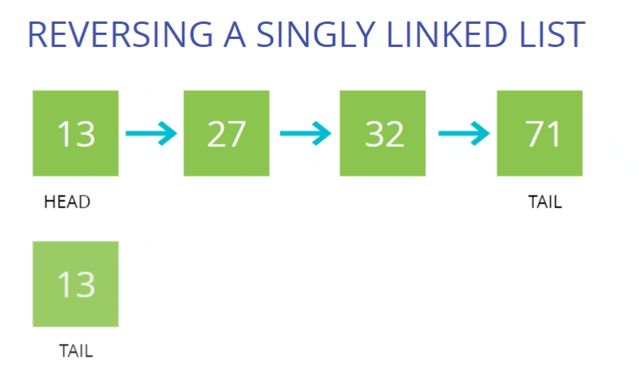

# Singly Linked List

[Singly Linked List Code](Singly_Linked_List.js)

What is a linked list?

- A data structure that contains a head, tail and length property.
- Linked Lists consist of nodes, and each node has a value and a pointer to another node or null

Singly Linked Lists

-   They are a bunch of **nodes** connected to each other in a single direction, strating from the **head** (starting node) all the way up to the **tail** (last node). Each node **points** to the next node in the linked list.
-   Comparisions between SLL and Array :

    |                     Singly Linked List                     |                            Arrays                             |
    | :--------------------------------------------------------: | :-----------------------------------------------------------: |
    | Do not have indexing,Connected to next node using pointers |                       Indexed in order                        |
    |  Insertion and deletion at the start or end is very easy   | Insertion and deletion can be expensive, when comapred to SLL |
    |            Random access of data isn't allowed             |            Can access elements at a specific index            |

-   We define a class for a **Node** and use that to define a class for our SLL.

## Reverse Singly Linked List

## Big O of Singly Linked Lists

- Insertion -   O(1)
- Removal -   It depends.... O(1) or O(N)
- Searching -   O(N)
- Access -   O(N)

## RECAP

- Singly Linked Lists are an excellent alternative to arrays when insertion and deletion at the beginning are frequently required
- Arrays contain a built in index whereas Linked Lists do not
- The idea of a list data structure that consists of nodes is the foundation for other data structures like Stacks and Queues
