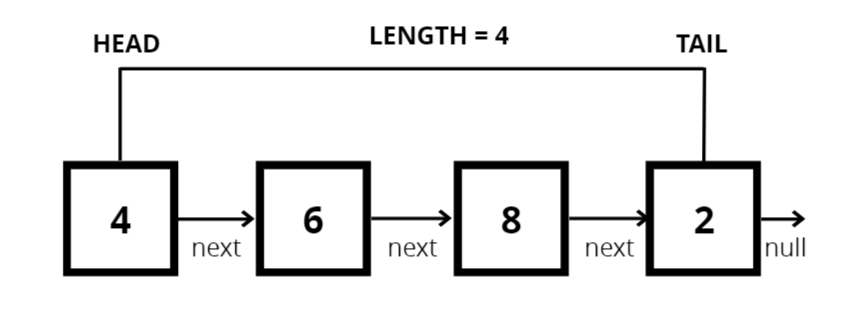

# Singly Linked List

What is a linked list?

- A data structure that contains a head, tail and length property.
- Linked Lists consist of nodes, and each node has a value and a pointer to another node or null

Singly Linked Lists

