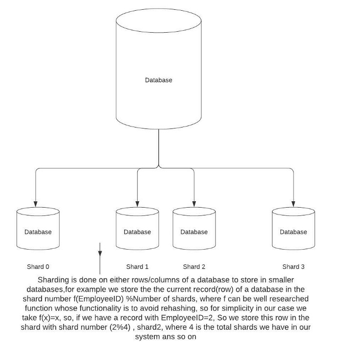

# System Design — Buzzwords to revise before going for an Interview
## Main Content

### Client-Server Model
A client and server networking model is a model in which computers such as servers provide the network services to the other computers such as clients to perform a user based tasks.

#### Protocols in networking
In networking, a protocol is a standardized set of rules for formatting and processing data. Protocols enable computers to communicate with one another.

### TCP vs UDP vs HTTP
HTTP requires a TCP connection, HTTP is an abstraction over TCP.
Overhead of creating UDP connections is much less than TCP connections(because of the concept of handshake in TCP)
UDP — Would be best for Data Steaming services as negligible time is required to form a connection.
TCP- Can be used to form more reliable connections.

### HTTP vs gRPC protocols
HTTP protocol uses ASCII characters to communicate between the services/resources, to reduce the latency of the protocol, we can use gRPC protocol instead which uses binary characters to transfer/communicate data.

### Latency vs Throughput
In any system, we want minimum latency and maximum throughput.
But what is latency and throughput?
Latency: Time taken between the time at which the response was sent and the time at which the request arrived at the system.
Throughput- Number of requests processed by a system in a unit of time.

### Caching
Caches are introduced in a system to faster the retrieval process and reduce the latency in getting the data from the resource.
This latency, in general, is due to the costly disk reads which happen during a read from the database.
Technologies that can be used to implement caching are Redis, Memcached. Amazon Elasticache can be used to implement Redis and Memcached in our system.

### Scaling
There comes a time in our system when our system is no longer producing the latency and throughput rates which we expect from our system, due to the increase in the number of requests received by our system. Then we have to look to expand our system so that our system will be able to handle such incoming requests.
We can expand our system in two ways- Horizontal Scaling and Vertical Scaling.

### Proxy and Reverse Proxy
A proxy server is any machine that translates traffic between networks or protocols. It’s an intermediary server separating end-user clients from the destinations that they browse. The client believes that they are communicating with the servers but in fact, they are communicating with the proxy server itself. Proxy servers can be used as firewalls, web filters and can also be used to cache the common requests and their responses.
A reverse proxy is a type of proxy server that retrieves resources on behalf of a client from one or more servers. These resources are then returned to the client, appearing as if they originated from the reverse proxy server itself. It is mainly used to balance the load.

### Load Balancers
In practice, a situation can arise where some servers are being hit multiple times and the server being within its capacity will be slow to respond to these multiple requests at a time, which will decrease the overall latency in the system.
So we introduce a data structure in between called a load balancer to evenly distribute requests between the servers.
A load balancer is also called a reverse proxy.

#### Formal definition:
A load balancer is a device that acts as a reverse proxy and distributes network or application traffic across a number of servers.
Technologies like Nginx can be used to implement load balancers.

### Sharding
Separating/breaking larger databases into more easily accessible parts called shards.

*Example of sharding*

#### Advantages of sharding
Increased Storage Capacity to hold the data.
Querying a smaller database is faster( as lesser search space )
Helps a lot in scaling imagine scaling the database across independent servers, each with its own CPU, memory, and disk.

#### Disadvantages of sharding

1. Resharding the data ->If a single shard is no longer able to hold more data due to rapid growth of the database itself, then due to uneven data distribution, some smaller shards might reach exhaustion and the data would need to be rehashed to different databases which could mean,

a) Introduction of new shards into the system.
b) Finding out a new hashing function to avoid uneven distribution of data among shards.

2. Celebrity problem:
Also called hotspot key problem, Excessive access to a specific shard could cause a server overload. ( imagine shah rukh khan or justin beiber’s records are in a certain shard, then that specific database is queried again and again leading to slowing down the whole of the system). So we might need to allocate a new shard for each celebrity!

3. Join and Denormalization
Once a DB is sharded among smaller databased, it is harder in a relational database ( be aware of the word relational database I have used here) to perform join operations( Natural join, Outer join, etc) across the DB shards., so we perform an operation called denormalization so that queries can be performed in the given table only rather than on many smaller tables ( smaller tables are formed due to normalization ).

### Few Conclusive points on databases

1. Memory is faster to access and disk reads are slow ( so try to avoid reading from the disks as much as we can )
2. Sharding should be done on an optimal column or a row based on the use case, and if sharding is done on some random column or row it would lead to abnormal “joins” across the shards, leading to abnormal delay in the system.
3. Consistent hashing is a technique to avoid one of the disadvantages of sharding ( that is in this article, written as resharding the data). Would discuss consistent hashing in the upcoming articles soon.
